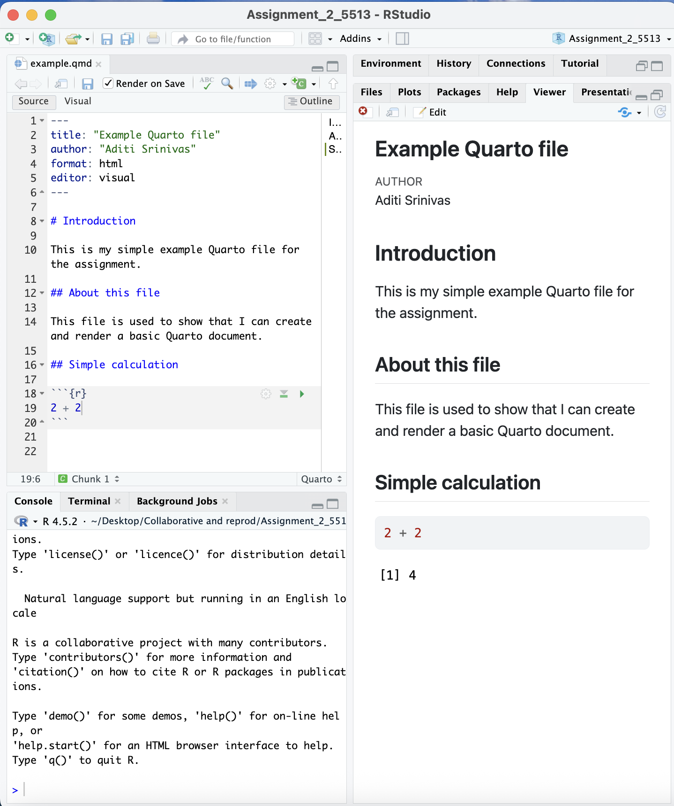

# Introduction

This guide shows the steps I followed to use Git, GitHub, RStudio, Quarto, and the command line for this assignment.

# Creating and Rendering example.qmd

I created a file called `example.qmd`. This is a simple Quarto file with markdown text and one small R code chunk.

After creating the file, I rendered it to HTML to check that it worked correctly.

